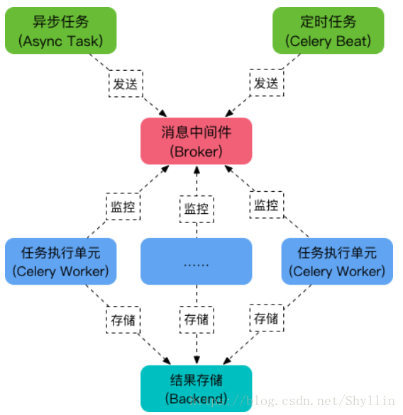

# Celery

 ### celery介绍

Celery 是一个强大的分布式任务队列，它可以让任务的执行完全脱离主程序，甚至可以被分配到其他主机上运行。我们通常使用它来实现异步任务async task和定时任务crontab。 

异步任务是发送邮件、或者文件上传、图像处理等比较耗时的操作

定时任务是需要在特定时间执行的任务。

架构如图

​	

- <b>任务队列</b>

  任务队列是一种跨线程、跨机器工作的一种机制.

  任务队列中包含称作任务的工作单元。

  有专门的工作进程持续不断的监视任务队列，并从中获得新的任务并处理.

- <b>任务模块</b>

  包含异步任务和定时任务。其中，异步任务通常在业务逻辑中被触发并发往任务队列，而定时任务由 Celery Beat 进程周期性地将任务发往任务队列。

- <b>消息中间件 Broker</b>

  Broker ，即为任务调度队列，接收任务生产者发来的消息（即任务），将任务存入队列。 

  Celery 本身不提供队列服务，官方推荐使用 RabbitMQ 和 Redis 等。

- <b>任务执行单元 Worker</b>

  Worker 是执行任务的处理单元，它实时监控消息队列，获取队列中调度的任务，并执行它。

- <b>任务结果存储 Backend</b>

  Backend 用于存储任务的执行结果，以供查询。

  同消息中间件一样，存储也可使用 RabbitMQ, Redis 和 MongoDB 等。

### 任务的步骤

- <b>异步任务的步骤</b>
  1. 创建一个 Celery 实例
  2. 启动 Celery Worker ，通过`delay()` 或 `apply_async()`(delay 方法封装了 apply_async, apply_async支持更多的参数 ) 将任务发布到broker
  3. 应用程序调用异步任务
  4. 存储结果 （发布的任务需要return才会有结果，否则为空）
  5. Celery Beat：任务调度器，Beat进程会读取配置文件的内容，周期性地将配置中到期需要执行的任务发送给任务队列

- <b>定时任务的步骤</b>
  1.  创建一个 Celery 实例
  2. 配置文件中配置任务 ，发布任务 `celery A xxx beat`
  3. 启动 Celery Worker
  4. 存储结果

## 分布式任务

关于Exchanges, queues and routing keys，大体关系如下：

1. 消息被发送到exchage
2. 关联到具体的queue
3. 消息被消费之前一直存在于queue中
4. 消息被消费后，自动从queue中删除

生产和消费消息的过程如下：

1. 创建exchange
2. 创建queue
3. 将queue绑定到exchange

celery会自动创建exchange、queue，并把queue绑定到exchange。